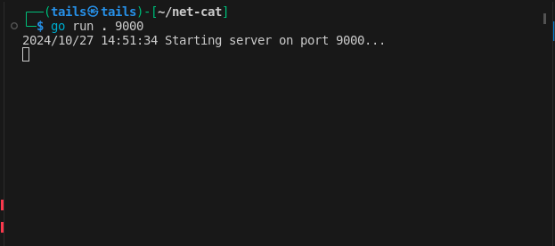
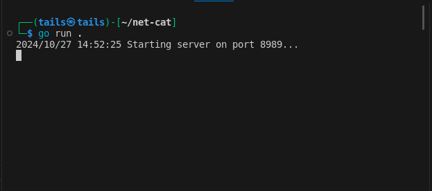
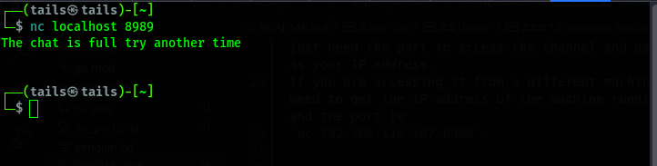

# net-cat

Net cat is a project that entails a Server-Client Architecture that can run in a server mode on a specified port listening for incoming connections, and it can be used in client mode, trying to connect to a specified port and transmitting information to the server.

NetCat, nc system command, is a command-line utility that reads and writes data across network connections using TCP or UDP. It is used for anything involving TCP, UDP, or UNIX-domain sockets, it is able to open TCP connections, send UDP packages, listen on arbitrary TCP and UDP ports and many more.

## Usage

### * 1. Clone the project
To clone the project to your machine run the following command
`git clone https://learn.zone01kisumu.ke/git/jmuchiri/net-cat.git`

### * 2. Running Netcat
First you have to go to where the program is using `cd net-cat`

Then after that you have to run the server. Now there are two ways to run the server

* By specifying the port.
You can specify the port on which the server can be accessed through by running `go run . <port>` i.e `go run . 9000`

* Without specifying the port
For this option you just run the server using the following command `go run .`. This will prompt a default port which is port 8989 and wiil be displayed after running

Once you have the server running you have to now access the channel. For this we use the nc command used in netcat `nc localhost <port>`. If you are run on the same machine you just need the port to access the channel and use local host as your IP address.
If you are accessing it from a different machine you will need to get the IP address of the machine running the server and the port ie
`nc 192.168.116.167 8989`.

When you access the channel, you will see a welcoming image and a command asking for your name. Here you enter you username that you would like to use 

You enter you username and continue. If the chat room is not full. If it is you will get a notification that the channel is full.

Now once in the chat you can now send messages between each other.

# Contribution

Contributions are welcome. Please adhere to the existing coding standards and include unit tests for any new features or changes. Ensure to thoroughly test the code before pushing any updates.
If you encounter any issues or have suggestions for improvement, feel free to submit an issue, pull request or propose a change!

Please follow these steps to contribute:

1.  Fork the repository
2.  Create a new branch (git checkout -b feature/AmazingFeature)
3.  Commit your changes (git commit -m 'Add some AmazingFeature')
4.  Push to the branch (git push origin feature/AmazingFeature)
5.  Open a Pull Request

# License

This Program is under the **MIT** Licence see [LICENSE](LICENSE) for details.

# Authors

This program was built and maintained by

- [jmuchiri](https://learn.zone01kisumu.ke/git/jmuchiri)

  

- [cliffootieno](https://learn.zone01kisumu.ke/git/cliffootieno)

  

* [wnjuguna](https://learn.zone01kisumu.ke/git/wnjuguna)

  

